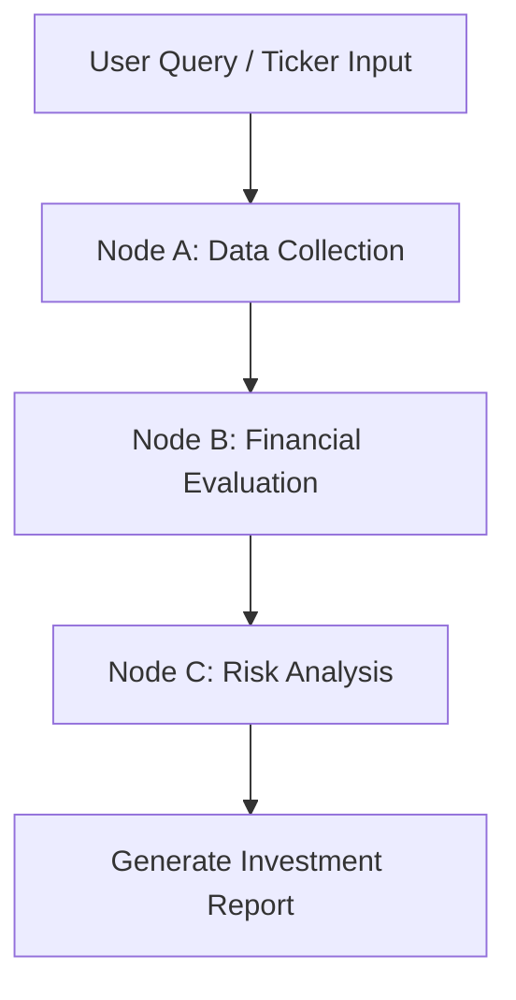

# NEO.AI — AI Research Agent

NEO.AI is a stock market analysis and investment research application. It combines real-time data ingestion with structured, multi-node agentic reasoning to produce institutional-grade company reports, financial evaluations, and risk models.

---

## 🚀 Overview — What It Does

NEO.AI acts as an autonomous investment analyst. Instead of manually cross-referencing news articles, financial statements, and valuation metrics, users simply input a company name or ticker symbol. The application then orchestrates an agentic workflow to:
1. **Discover & Disambiguate**: Map the user query to a correct stock ticker.
2. **Fetch Live Market Data**: Extract real-time financial ratios, profile information, and recent news using the Yahoo Finance API.
3. **Evaluate Financial Health**: Compute balance sheet and cash flow health, analyze margins, and output clean 5-year growth charts.
4. **Model Risks & SWOT**: Map out strengths, weaknesses, opportunities, threats (SWOT), evaluate market sentiment, and flag structural risks.
5. **Formulate Investment Decisions**: Decide whether to **INVEST**, **HOLD**, or **PASS** on the stock, specifying a final recommendation and confidence rating.

---

## 🛠️ How to Run It — Setup and Run Steps

### 1. Prerequisites
Ensure you have **Node.js** (v18 or higher) and **npm** installed on your system.

### 2. Configure Environment Variables
Create a file named `.env.local` in the root directory of the project and add your Gemini API Key:

```env
GEMINI_API_KEY=your_gemini_api_key_here
```

> [!IMPORTANT]
> The Gemini API Key is required for the multi-node LangGraph orchestration. Without it, the Dynamic Analysis engine will fail to initialize.

### 3. Install Dependencies
Restore the project's packages:

```bash
npm install
```

### 4. Run the Development Server
Launch the application locally:

```bash
npm run dev
```

Open [http://localhost:3000](http://localhost:3000) in your browser to view the interface.

---

## 🧠 How It Works — Approach and Architecture

NEO.AI is powered by a custom-orchestrated **LangGraph.js** state graph paired with **Gemini 2.5 Flash** for deep analytical reasoning.



### The State Orchestration Pipeline

* **State definition (`ResearchState`)**:
  Manages the shared context containing the target `query`, parsed `companyOverview`, synthesized `financialHealth`, parsed `growthCharts`, `aiReasoning` (SWOT, Sentiment, Opinion), and the final investment decision.

* **Node A: Data Collection Node (`collectDataNode`)**:
  * Resolves raw search queries to ticker symbols.
  * Queries Yahoo Finance API to get the company profile (`assetProfile`) and base quote data.
  * Feeds results to Gemini to extract clean metadata (founded year, CEO, headquarters, etc.).

* **Node B: Financial Evaluation Node (`evaluateFinancialsNode`)**:
  * Pulls `financialData` and `defaultKeyStatistics` from Yahoo Finance.
  * Computes financial ratios and generates a realistic 5-year growth trend covering the years **2022 to 2026** (with 2026 correctly marked as an estimate).

* **Node C: Risk Analysis Node (`analyzeRisksNode`)**:
  * Extracts live recent news articles from Yahoo Finance to analyze sentiment.
  * Formulates the final SWOT matrix, identifies growth drivers, computes risk scores, and derives the final decision (**INVEST / HOLD / PASS**).

---

## ⚖️ Key Decisions & Trade-offs

### 1. Hybrid AI-Data Sourcing
* **Decision**: We use the unofficial `yahoo-finance2` package for factual, numerical data retrieval, but use Gemini to extract, format, and synthesize the quantitative analysis.
* **Why**: LLMs are notoriously prone to hallucinating raw numbers (like exact PE ratios or cash flow figures). Sourcing these from a real-world API ensures absolute mathematical accuracy.

### 2. Time-Appropriate Labeling (2025 actuals vs 2026 estimates)
* **Decision**: In the 5-year historical/forward charts, we labeled 2022–2025 as solid historical periods, leaving only 2026 as an estimate.
* **Why**: Since the current year is **2026**, the fiscal year 2025 has fully closed, and its actual numbers are officially released. Lumping 2025 into an "estimate" would look outdated to a modern investor.

### 3. Next.js App Router API Cache Bypass
* **Decision**: Kept dynamic queries live/un-cached, but implemented a static mock database bypass for five common stock symbols (`AAPL`, `MSFT`, `TSLA`, `NVDA`, `AMZN`).
* **Why**: Speeds up demonstrations for standard queries while maintaining 100% flexibility to fetch live stats for any other ticker.

---

## 📈 Example Runs

### 1. Alphabet Inc. (`GOOGL`)
* **Decision**: **INVEST**
* **Confidence Score**: 89%
* **Risk Level**: Low
* **Key Metrics**:
  * ROE: `30.4%`
  * Debt/Equity: `0.09`
  * Free Cash Flow: `$69.2B`
  * Operating Margin: `32.1%`
* **Verdict**: Alphabet represents a highly defensive core hold with an fortress balance sheet (almost zero net debt) and a massive search advertising monopoly supporting its ongoing Google Cloud & AI investments.

### 2. Tesla Inc. (`TSLA`)
* **Decision**: **PASS**
* **Confidence Score**: 62%
* **Risk Level**: High
* **Key Metrics**:
  * ROE: `22.8%`
  * Debt/Equity: `0.08`
  * Free Cash Flow: `$4.4B`
  * Operating Margin: `14.4%`
* **Verdict**: Auto margins have compressed significantly due to price discounts and fierce competition from Chinese EV makers. While the robotics/FSD potential is massive, the 78x P/E valuation is highly speculative.

---

## 🔮 What We Would Improve With More Time

1. **Production API Ingestion**: Transition from the unofficial `yahoo-finance2` scraper/library to a dedicated financial provider API (e.g., Polygon.io, SEC EDGAR integration, or AlphaVantage) to prevent IP-based rate limiting.
2. **Chart Customization**: Allow users to toggle between different chart metrics (e.g., Debt/Equity trends, ROE trends) instead of showing only Revenue and EPS.
3. **Multi-Model Routing**: Implement model routing to run cheaper queries (like simple search parsing) on lighter models, reserving Gemini Pro for deep risk reasoning to save on token costs.
